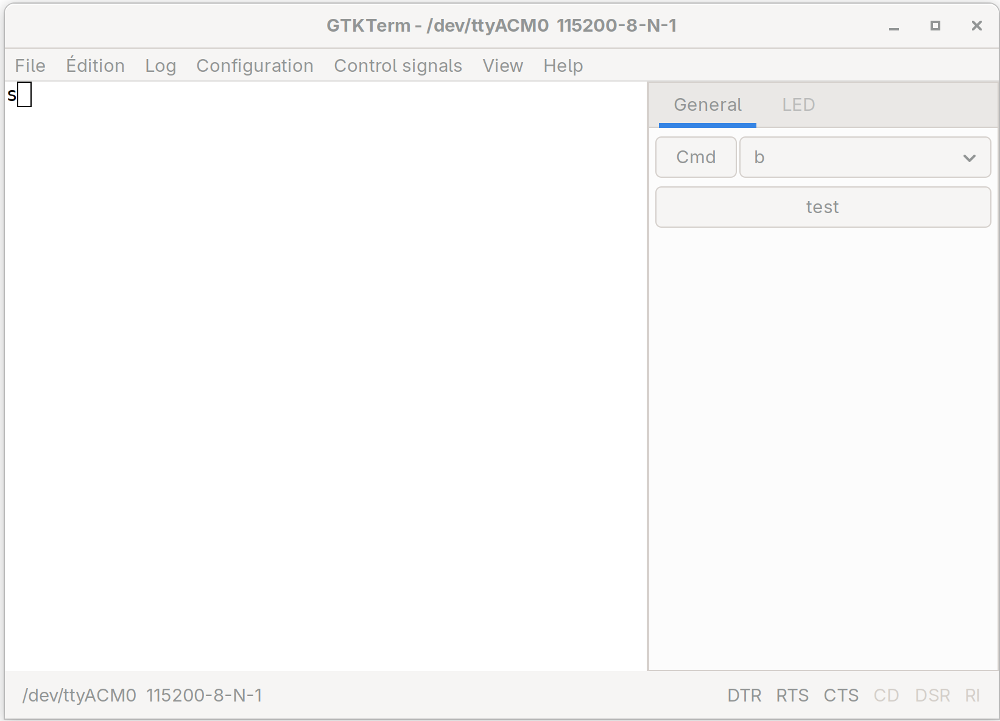
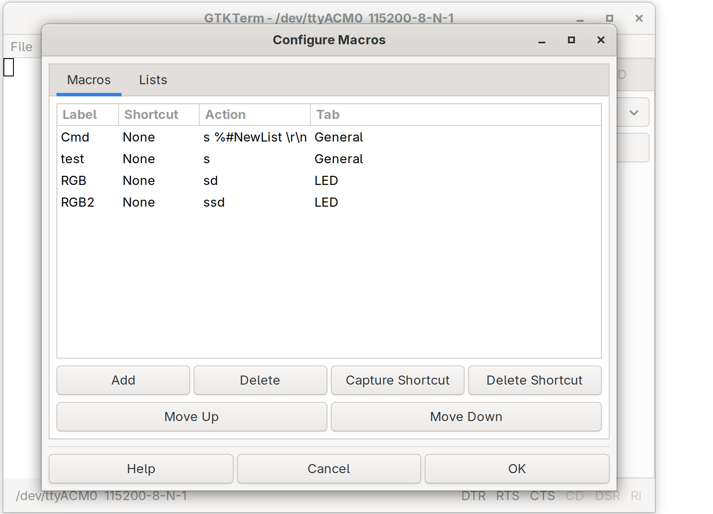
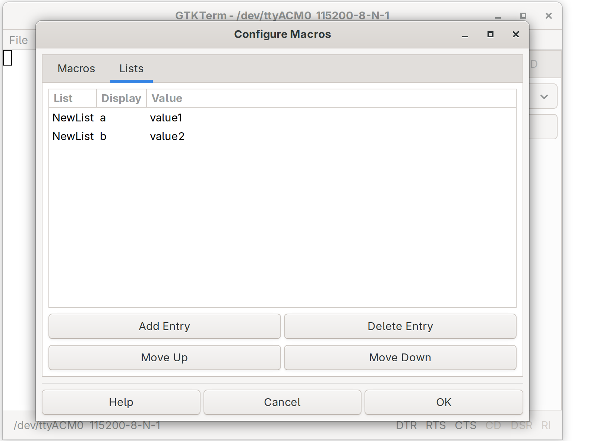

# GTKTerm Fork

1. Separate Macros File
- Macros and lists are stored in a standalone .ini file, independent from the serial port config (.gtktermrc) 
- Menu items "Load macros file..." and "Save macros file" open a file chooser dialog
- The last used macros file path is saved in .gtktermrc and auto-loaded at startup
                                                                                                              
2. Value Lists (New "Lists" Tab)
- In the Macros configuration window, a new "Lists" tab lets you define named lists of display/value pairs
- Each list entry has a List name, Display text (shown in UI), and Value (sent to serial port)
- Lists are referenced in macro actions using %#ListName syntax
- Example: A list called "Commands" with entries like "Reset" → "AT+RESET", "Ping" → "AT+PING"
                                                                                                              
3. Macros with Format Arguments
- Macro actions support printf-style format specifiers:
  - %s – string
  - %d / %i – signed integer
  - %u / %o / %x – unsigned integer (decimal/octal/hex)
  - %f – floating point
  - %c – single character
- Macros with arguments automatically generate buttons with input fields in the macro panel
- Example action: "AT+SEND=%s\r\n" → user types the string, macro sends the full command
                                                                                                              
4. List Arguments in Macros
- Using %#ListName in a macro action creates a combo box dropdown in the button UI
- User selects from the predefined list values before sending
- Can be combined with regular format args: "CMD=%#Commands=%d\r\n"
                                                                                                              
5. Reorder Buttons (Move Up/Down)
- Both the Macros tab and Lists tab have "Move Up" / "Move Down" buttons
- Lets you reorder macros and list entries to match your preferred workflow

    

    

    

# GTKTerm: A GTK+ Serial Port Terminal

GTKTerm is a simple, graphical serial port terminal emulator for Linux and possibly other POSIX-compliant operating systems. It can be used to communicate with all kinds of devices with a serial interface, such as embedded computers, microcontrollers, modems, GPS receivers, CNC machines and more.

## Usage
### Keyboard Shortcuts 
As GTKTerm is often used like a terminal emulator,
the shortcut keys are assigned to `<ctrl><shift>`, rather than just `<ctrl>`. This allows the user to send keystrokes of the form `<ctrl>X` and not have GTKTerm intercept them.

Key Combination | Effect
---:|---
`<ctrl><shift>L` | Clear screen
`<ctrl><shift>R` | Send file
`<ctrl><shift>Q` | Quit
`<ctrl><shift>S` | Configure port
`<ctrl><shift>V` | Paste
`<ctrl><shift>C` | Copy
`<ctrl><shift>F` | Find
`<ctrl><shift>K` | Clear Scrollback
`<ctrl><shift>A` | Select All
`<ctrl><shift>B` | Send Break
`<ctrl>B` | Send break
F5 | Open Port
F6 | Close Port
F7 | Toggle DTR
F8 | Toggle RTS

### Command Line Options
See `man gtkterm` or `gtkterm --help` for more information on available command line interface options.

### Notes on RS485:
The RS485 flow control is a software user-space emulation and therefore may not work for all configurations (won't respond quickly enough). If this is the case for your setup, you will need to either use a dedicated RS232 to RS485 converter, or look for a kernel level driver. This is an inherent limitation to user space programs.

### Scriptability with Signals
Some microcontrollers and other embedded devices are flashed using the same serial interface that is also used for outputting debug information. To facilitate rapid development on these platforms, GTKTerm supports the following UNIX signals:

Signal | Action | Usage Example
---:|:---:|---
`SIGUSR1` | Open Port | `killall -USR1 gtkterm`
`SIGUSR2` | Close Port | `killall -USR2 gtkterm`

You may find it useful to send these signals in your own firmware flashing scripts.

## Installation
GTKTerm has a few dependencies-
* Gtk+3.0 (version 3.12 or higher)
* vte (version 0.40 or higher)
* intltool (version 0.40.0 or higher)
* libgudev (version 229 or higher)

Once these dependencies are installed, most people should simply run:

	meson build
	ninja -C build

To install GTKTerm system-wide, run:

	ninja -C build install
	gtk-update-icon-cache

If you wish to install GTKTerm someplace other than the default directory, e.g. in `/usr`, use:

	meson build -Dprefix=/usr

Then build and install as usual.

## Uninstallation
To uninstall GTKTerm, run:

	ninja -C build uninstall

If you already deleted the `build` directory, just compile and install GTKTerm again as explained in the [previous section](#installation) with the same target location prefix (`-Dprefix`) and perform the uninstall step afterwards.

## License
Original Code by: Julien Schmitt

    This program is free software: you can redistribute it and/or modify
    it under the terms of the GNU General Public License as published by
    the Free Software Foundation, either version 3 of the License, or
    (at your option) any later version.

    This program is distributed in the hope that it will be useful,
    but WITHOUT ANY WARRANTY; without even the implied warranty of
    MERCHANTABILITY or FITNESS FOR A PARTICULAR PURPOSE.  See the
    GNU General Public License for more details.

    You should have received a copy of the GNU General Public License
    along with this program.  If not, see <http://www.gnu.org/licenses/>.
